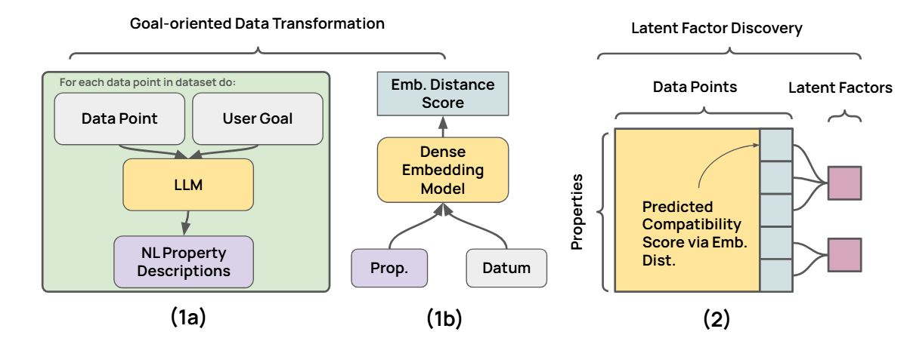

### Goal-conditioned Latent Factor Discovery without Task Supervision

---


Steps to run:
- Navigate to each task's folder
- Run ```generate_concepts.py``` to propose attributes with LLM (need openai key, or use open-source models)
  - See e.g., ```./inspired/generate_concept.py#L60``` for how to switch models and adjust multi-processing
  - The concept annotation process is parallized thanks to [Dongfu Jiang](https://jdf-prog.github.io/)'s [framework](https://github.com/jdf-prog/LLM-Engines)
- Run ```train_nli.py``` to train compatibility estimation model
- Run ```fit_corex.py``` to learn latent factor model
- Run ```evaluate.py``` to get evaluation results (dataset/use-case specific, really)
- Questions about environment? See requirements.md

Using your own dataset?
- The main part to modify is ```generate_concepts.py```, specifically:
  - new data loading scripts 
  - modify the instructions to LLMs to fit your task 
 
